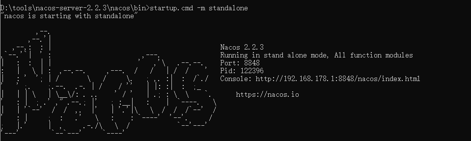
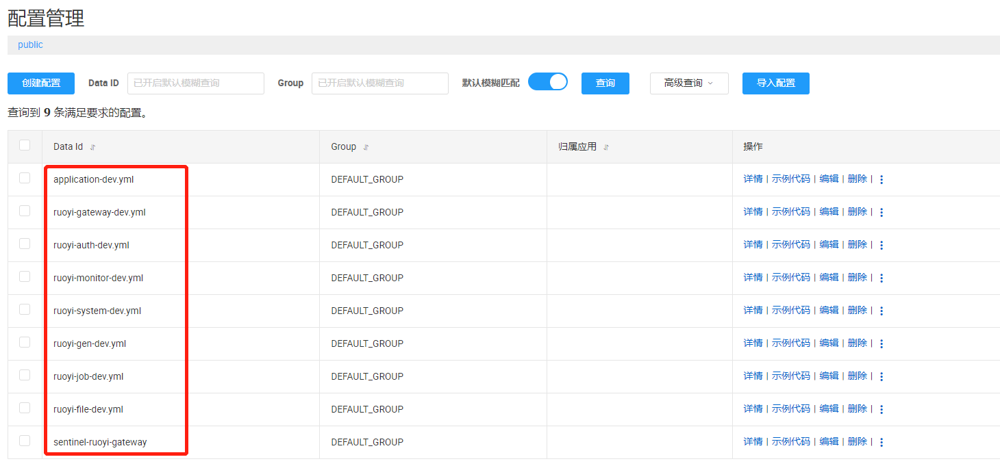
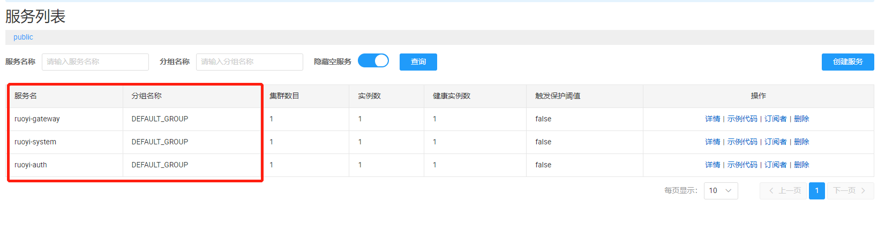

## 一、运行ruoyi微服务系统

### 1. 下载并导入git项目

- 前往`Gitee`下载页面([https://gitee.com/y_project/RuoYi-Cloud (opens new window)](https://gitee.com/y_project/RuoYi-Cloud))下载解压到工作目录

### 2. 创建数据库

- 创建数据库`ry-cloud`并导入数据脚本`ry_2021xxxx.sql`（必须），quartz.sql（可选）
- 创建数据库`ry-config`并导入数据脚本`ry_config_2021xxxx.sql`（必须）

### 3. 安装nacos服务注册中心

- 可以从`https://github.com/alibaba/nacos/releases`下载`nacos-server-$version.zip`包。

  Windows下载解压后（.zip），直接点击`bin/startup.cmd -m standalone`就可以了。

  Nacos默认是`集群模式cluster`，可以`startup.cmd`属性`MODE`为`单机模式standalone`

- 配置`nacos`持久化，修改`conf/application.properties`文件，增加支持`mysql`数据源配置，让nacos启动后能够读到数据库中的相关配置文件：

```shell
# db mysql
spring.datasource.platform=mysql
db.num=1
db.url.0=jdbc:mysql://localhost:3306/ry-config?characterEncoding=utf8&connectTimeout=1000&socketTimeout=3000&autoReconnect=true&useUnicode=true&useSSL=false&serverTimezone=UTC
db.user=root
db.password=password
```

- 启动：



- 浏览器访问localhost:8848，可以在配置列表中看到相关的微服务配置：



### 4. 后端运行基础模块

- RuoYiGatewayApplication （网关模块 必须）
- RuoYiAuthApplication （认证模块 必须）
- RuoYiSystemApplication （系统模块 必须）
- RuoYiMonitorApplication （监控中心 可选）
- RuoYiGenApplication （代码生成 可选）
- RuoYiJobApplication （定时任务 可选）
- RuoYFileApplication （文件服务 可选）

**在运行对应的微服务模块时，需要去nacos配置中心修改对应的配置文件：redis，mysql连接信息等**

### 5. 运行前端项目

```shell
# 安装依赖
npm install

# 强烈建议不要用直接使用 cnpm 安装，会有各种诡异的 bug，可以通过重新指定 registry 来解决 npm 安装速度慢的问题。
npm install --registry=https://registry.npmmirror.com

# 本地开发 启动项目
npm run dev
```

- 出现openssl相关报错，在package.json中修改启动和打包命令:

```shell
"dev": "SET NODE_OPTIONS=--openssl-legacy-provider && vue-cli-service serve",
"build:prod": "SET NODE_OPTIONS=--openssl-legacy-provider && vue-cli-service build",
```

- 前端运行成功后，浏览器访问localhost，可以看到已启动的微服务能够正常访问，并且在nacos中也可以看到已经启动的微服务。

