## 一、运行ruoyi微服务系统

### 1. 下载并导入git项目

- 前往`Gitee`下载页面([https://gitee.com/y_project/RuoYi-Cloud (opens new window)](https://gitee.com/y_project/RuoYi-Cloud))下载解压到工作目录

### 2. 创建数据库

- 创建数据库`ry-cloud`并导入数据脚本`ry_2021xxxx.sql`（必须），quartz.sql（可选）
- 创建数据库`ry-config`并导入数据脚本`ry_config_2021xxxx.sql`（必须）

### 3. 安装nacos服务注册中心

- 可以从`https://github.com/alibaba/nacos/releases`下载`nacos-server-$version.zip`包。

  Windows下载解压后（.zip），直接点击`bin/startup.cmd -m standalone`就可以了。

  Nacos默认是`集群模式cluster`，可以`startup.cmd`属性`MODE`为`单机模式standalone`

- 配置`nacos`持久化，修改`conf/application.properties`文件，增加支持`mysql`数据源配置，让nacos启动后能够读到数据库中的相关配置文件：

```shell
# db mysql
spring.datasource.platform=mysql
db.num=1
db.url.0=jdbc:mysql://localhost:3306/ry-config?characterEncoding=utf8&connectTimeout=1000&socketTimeout=3000&autoReconnect=true&useUnicode=true&useSSL=false&serverTimezone=UTC
db.user=root
db.password=password
```

- 启动：

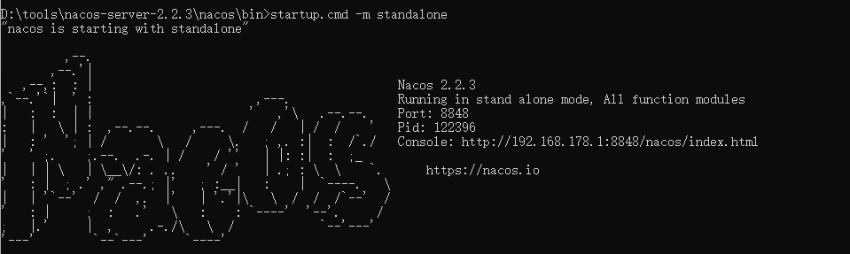

- 浏览器访问localhost:8848，可以在配置列表中看到相关的微服务配置：

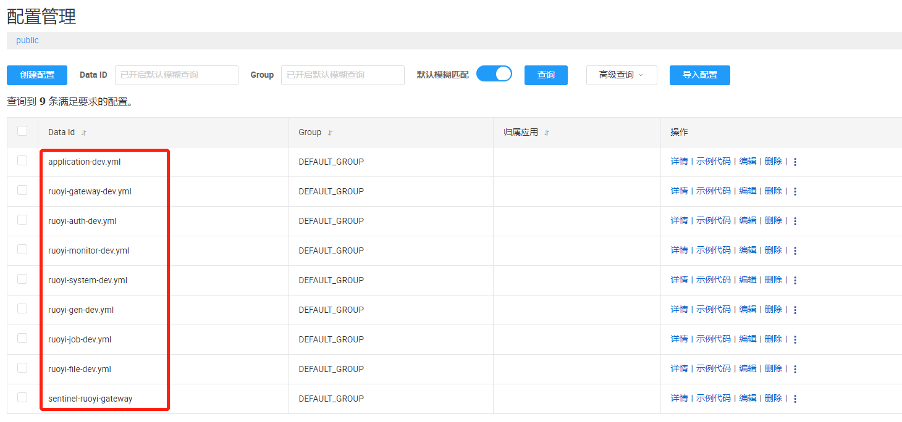

### 4. 后端运行基础模块

- RuoYiGatewayApplication （网关模块 必须）
- RuoYiAuthApplication （认证模块 必须）
- RuoYiSystemApplication （系统模块 必须）
- RuoYiMonitorApplication （监控中心 可选）
- RuoYiGenApplication （代码生成 可选）
- RuoYiJobApplication （定时任务 可选）
- RuoYFileApplication （文件服务 可选）

**在运行对应的微服务模块时，需要去nacos配置中心修改对应的配置文件：redis，mysql连接信息等**

### 5. 运行前端项目

```shell
# 安装依赖
npm install

# 强烈建议不要用直接使用 cnpm 安装，会有各种诡异的 bug，可以通过重新指定 registry 来解决 npm 安装速度慢的问题。
npm install --registry=https://registry.npmmirror.com

# 本地开发 启动项目
npm run dev
```

- 出现openssl相关报错，在package.json中修改启动和打包命令:

```shell
"dev": "SET NODE_OPTIONS=--openssl-legacy-provider && vue-cli-service serve",
"build:prod": "SET NODE_OPTIONS=--openssl-legacy-provider && vue-cli-service build",
```

- 前端运行成功后，浏览器访问localhost，可以看到已启动的微服务能够正常访问，并且在nacos中也可以看到已经启动的微服务。

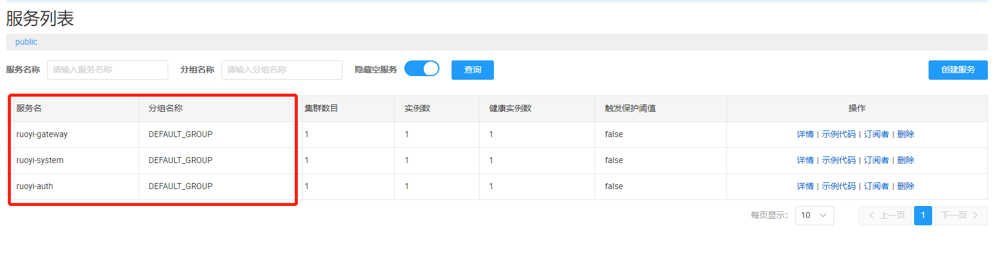

## 二、 SpringCloud Gateway服务网关

### 1. 服务网关使用

1. 添加依赖：

```xml
<!-- spring cloud gateway 依赖 -->
<dependency>
	<groupId>org.springframework.cloud</groupId>
	<artifactId>spring-cloud-starter-gateway</artifactId>
</dependency>
```

2. 编辑`resources/application.yml`配置文件

```yml
server:
  port: 8081

spring: 
  application:
    name: ruoyi-gateway
  cloud:
    gateway:
      routes:
        # 系统模块
        - id: ruoyi-system
          # 将/system开头的请求都转发至localhost:9201(系统模块接口)中
          uri: http://localhost:9201/  
          predicates:
            - Path=/system/**
          filters:
            # 转发时去除system前缀
            - StripPrefix=1
```

3. 编写网关测试启动类

```java
@SpringBootApplication
public class RuoYiGatewayApplication
{
    public static void main(String[] args)
    {
        SpringApplication.run(RuoYiGatewayApplication.class, args);
        System.out.println("(♥◠‿◠)ﾉﾞ  若依测试网关启动成功   ლ(´ڡ`ლ)ﾞ");
    }
}
```

4. 整体目录如下：

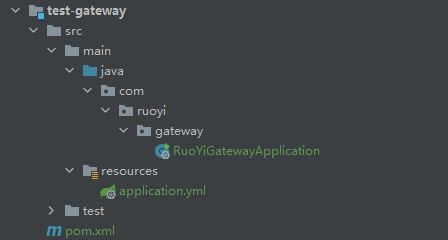

4. 启动若依系统模块服务和以上网关测试服务
5. 浏览器访问系统模块接口测试：

- 直接访问系统模块服务接口：

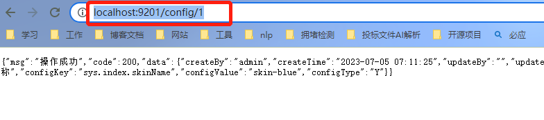

- 通过测试网关转发访问该接口：

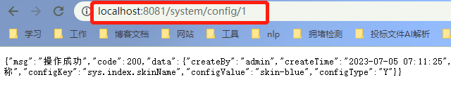

### 2. 路由规则

- http://doc.ruoyi.vip/ruoyi-cloud/cloud/gateway.html#%E8%B7%AF%E7%94%B1%E8%A7%84%E5%88%99

```yml
predicates:
    - Path=/system/**
    # 匹配日期时间之后发生的请求
    - After=2023-07-06T10:23:00.000+08:00[Asia/Shanghai]
    # 匹配具有指定名称的请求头，\d+值匹配正则表达式
    - Header=X-Request-Id, \d+
```

### 3. 网关路由配置

- 在`spring cloud gateway`中配置`uri`有三种方式，包括

```yml
spring:
  cloud:
    gateway:
      routes:
        - id: ruoyi-api
          # 1.websocket配置方式
          uri: ws://localhost:9090/
          # 2.http地址配置方式
          uri: http://localhost:9090/
          # 3.注册中心配置方式
          uri: lb://ruoyi-api
          predicates:
            - Path=/api/**
```

- 在微服务中，通常使用注册中心配置方式来配置网关路由

  - 首先在网关模块中导入nacos依赖;

  ```xml
          <!-- SpringCloud Alibaba Nacos -->
          <dependency>
              <groupId>com.alibaba.cloud</groupId>
              <artifactId>spring-cloud-starter-alibaba-nacos-discovery</artifactId>
          </dependency>
  ```

  - 修改配置文件：

  ```yml
  server:
    port: 8081
  
  spring:
    application:
      name: test-gateway
    cloud:
      nacos:
        discovery:
          # 服务注册地址
          server-addr: 127.0.0.1:8848
      gateway:
        routes:
          # 系统模块
          - id: ruoyi-system
            # 将/system开头的请求都转发至localhost:9201(系统模块接口)中
            # 1.http地址配置方式
            # uri: http://localhost:9201/
            # 2.注册中心配置方式
            uri: lb://ruoyi-system
            predicates:
              - Path=/system/**
            filters:
              # 转发时去除system前缀
              - StripPrefix=1
  ```

  - 重启服务，nacos服务注册中心可看见该服务注册成功，再测试网关是否转发成功
  - **测试结果：使用http地址配置方式，请求能成功转发，但使用注册中心配置方式，请求始终提示服务不可达？？**

  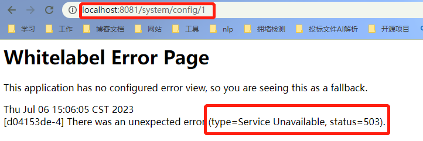
  
  - 解决方案：lb配置未生效，需要引入相关的lb依赖：
  
  ```xml
  <dependency>
    <groupId>org.springframework.cloud</groupId>
    <artifactId>spring-cloud-starter-loadbalancer</artifactId>
  </dependency>
  ```

### 4. 网关限流配置

- 参考ruoyi官方文档：服务网关->限流配置
- 测试成功，频繁请求返回如下：

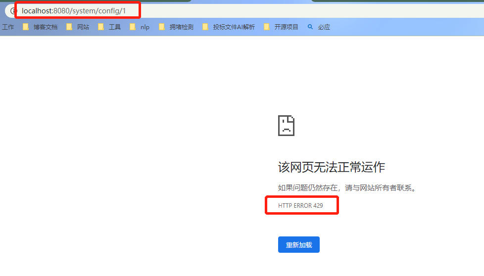

### 5. 跨域配置

- **通常情况下不会出现跨域问题：不会出现跨域（开发环境默认通过proxy代理的方式，同理部署到生产也需要配置nginx代理）**

  - 开发环境proxy代理方式：

  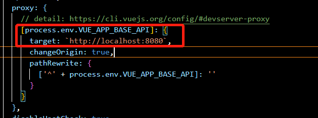

- 模拟跨域问题：修改登录请求url(完整的路由地址就不会走上述的代理)

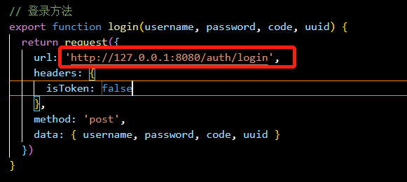

- 调用登录接口，出现跨域问题：

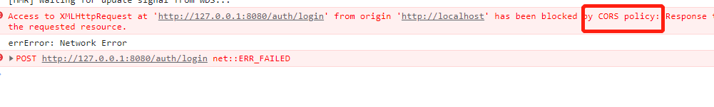

### 6. 黑白名单配置

- 启动网关和system微服务，直接通过网关访问system微服务接口，返回结果如下：

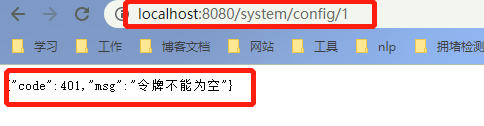

- 修改网关配置，将system相关接口加入白名单中：

```yaml
  # 不校验白名单
  ignore:
    whites:
      - /system/**
```

- 再次请求该接口，访问成功：

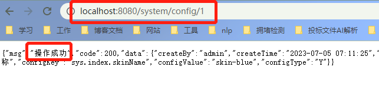

- 再修改网关配置，将system/config相关接口加入黑名单中

```yaml
        # 系统模块
        - id: ruoyi-system
          uri: lb://ruoyi-system
          predicates:
            - Path=/system/**
          filters:
            - StripPrefix=1
            - name: BlackListUrlFilter
              args:
                blacklistUrl:
                - /config
```

- 再次请求该接口：

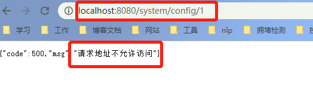

### 7. Sentinel限流

1. 实现Sentinel限流：

- 添加依赖：

```xml
<!-- SpringCloud Alibaba Sentinel -->
<dependency>
	<groupId>com.alibaba.cloud</groupId>
	<artifactId>spring-cloud-starter-alibaba-sentinel</artifactId>
</dependency>
		
<!-- SpringCloud Alibaba Sentinel Gateway -->
<dependency>
	<groupId>com.alibaba.cloud</groupId>
	<artifactId>spring-cloud-alibaba-sentinel-gateway</artifactId>
</dependency>
```

- 编写限流规则配置类

```java
@Configuration
public class GatewayConfig
{
    @Bean
    @Order(-1)
    public GlobalFilter sentinelGatewayFilter()
    {
        return new SentinelGatewayFilter();
    }

    @PostConstruct
    public void doInit()
    {
        // 加载网关限流规则
        initGatewayRules();
    }

    /**
     * 网关限流规则
     */
    private void initGatewayRules()
    {
        Set<GatewayFlowRule> rules = new HashSet<>();
        /**
         * ruoyi-system对应getway网关配置中的id
         */
        rules.add(new GatewayFlowRule("ruoyi-system")
                .setCount(3) // 限流阈值
                .setIntervalSec(60)); // 统计时间窗口，单位是秒，默认是 1 秒
        // 加载网关限流规则
        GatewayRuleManager.loadRules(rules);
    }
}
```

- 频繁访问测试：

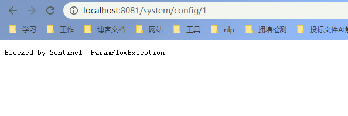
